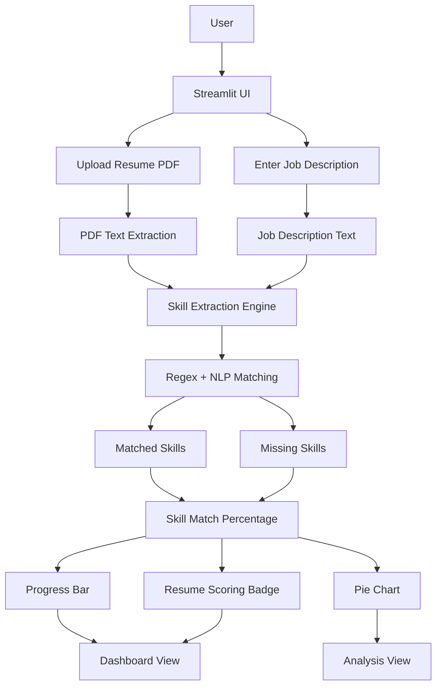

# Resume Skill Matcher 🚀

I handled ATS keyword weighting using a dictionary-based scoring system and added defensive checks to ensure stability during deployment and refactoring.
A professional NLP-powered Streamlit application that analyzes a resume against a job description and calculates a skill match score.  
Designed for recruiters and job seekers to quickly evaluate resume relevance.

Live Link : https://resume-skill-matcher-by-tejas.streamlit.app/
---
## 🏗 Architecture Flow (Mermaid Diagram)

## 🔍 What This Project Does

- Upload a resume in PDF format  
- Paste a job description  
- Extract skills using NLP + regex  
- Calculate skill match percentage  
- Suggest missing skills  
- Display progress bar, pie chart, and scoring badge  
- Navigate through Dashboard, Analysis, and About sections  

---

## 🧠 Why This Project Stands Out

- Solves a real recruiter problem  
- Demonstrates practical NLP thinking  
- Clean and professional UI with animations  
- Easy to explain and demo in interviews  
- Deployed as a live web app  

---

